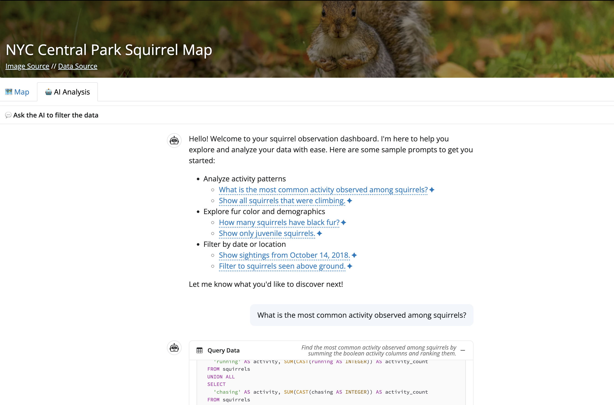
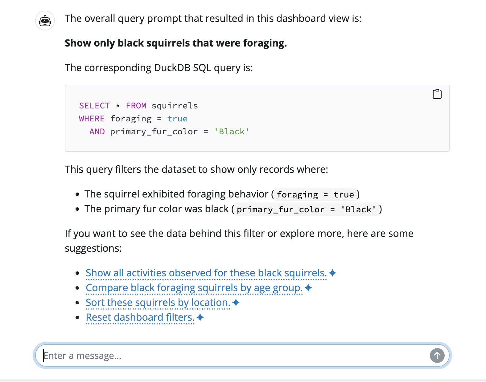
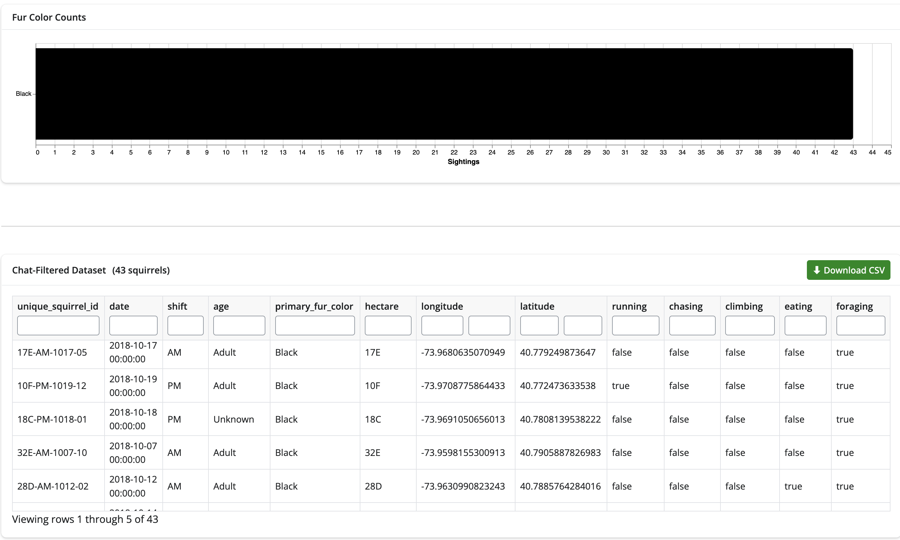

# CHANGELOG

All notable changes to this project are documented in this file.

## [0.4.0] - 2025-03-17

### Added

-   <!-- New features, components, tests - one line each. Reference PRs where relevant (e.g. #12). -->

### Changed

-   data cleaning moved from `eda.ipynb` and `app.py` to new `data_processing.py` script to improve read

-   DuckDB and Parquet implemented into `app.py`

-   <!-- Spec or design deviations, and motivation. -->

-   <!-- Feedback items you addressed: "Addressed: <item description> (#<prioritization issue>) via #<PR>" -->

### Fixed

-   <!-- Bugs resolved since M3. -->

-   **Feedback prioritization issue link:** #...

### Known Issues

-   <!-- Anything incomplete or broken TAs should be aware of (so it isn't mistaken for unfinished work). -->

### Release Highlight: [Name of your advanced feature]

<!-- One short paragraph describing what you built and what it does for the user. -->

-   **Option chosen:** A / B / C / D
-   **PR:** #...
-   **Why this option over the others:** <!-- 1–2 sentences; link to your feature prioritization issue -->
-   **Feature prioritization issue link:** #...

### Collaboration

<!-- Summary of workflow or collaboration improvements made since M3. -->

-   **CONTRIBUTING.md:** <!-- Link to the PR that updated it with your M3 retrospective and M4 norms. -->
-   **M3 retrospective:** <!-- What changed in your workflow after M3 collaboration feedback. -->
-   **M4:** <!-- What you tried or improved this milestone. -->

### Reflection

```{=html}
<!-- Standard (see General Guidelines): what the dashboard does well, current limitations,
     any intentional deviations from DSCI 531 visualization best practices. -->
```

<!-- Trade-offs: one sentence on feedback prioritization - full rationale is in #<issue> and ### Changed above. -->

```{=html}
<!-- Most useful: which lecture, material, or feedback shaped your work most this milestone,
     and anything you wish had been covered. -->
```

## [0.3.0] - 2026-03-08

### Added

-   Added a new AI Analysis tab powered by QueryChat.
-   Added chat interface for natural-language filtering.
-   Added chat-filtered data table.
-   Added charts based on chat-filtered dataframe.
-   Added CSV download for chat-filtered data.



### Changed

-   Updated app to support both regular filtering and AI-driven filtering.
-   Configured AI client to use GitHub Models via environment variables.

### Fixed

-   Improved empty-state handling for AI outputs.

[] []

### Known Issues

-   AI filters may occasionally be inconsistent.
-   API rate limits can slow responses.

### Reflection

-   AI tab improves usability and exploration workflow.
