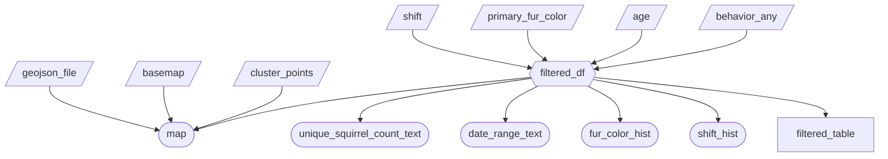

# App Specification

### Job Stories
| # | Job Story                                  | Status            | Notes                              |
|---|--------------------------------------------|------------------|-------------------------------------|
| 1 | *As a* wildlife ecology researcher, *I want to* filter squirrel sightings on a map by specific behaviors (running, eating, foraging, climbing) *so that I can* identify behavioral hotspots and plan targeted field observations in those areas.     | ⏳ Pending    |                                      |
| 2 | *As a* Central Park tourist, *I want to* see which areas of the park have the highest number of squirrels that are comfortable around humans (indifferent or approaching) *so that I can* visit those spots for a more interactive wildlife experience.  | ⏳ Pending        |      |
| 3 | *As a* squirrel census volunteer, *I want to* compare the distribution of fur colours and vocalization patterns across different park regions and times of day (AM/PM shift) *so that I can* understand whether certain squirrel populations dominate specific habitats or are more active at particular times.     | ⏳ Pending      |                                     |

### Component Inventory
| ID           | Type          | Shiny widget / renderer | Depends on                    | Job story   |
|--------------|--------------|--------------------------|------------------------------|------------|
| `geojson_file` | Input        | `ui.input_select()`      | —                            |      |
| `shift` | Input        | `ui.input_selectize()`      | —                            | #3     |
| `primary_fur_color` | Input        | `ui.input_selectize()`      | —                            | #3     |
| `age` | Input        | `ui.input_selectize()`      | —                            | #1, #2     |
| `behavior_any` | Input        | `ui.input_selectize()`      | —                            | #1, #2     |
| `basemap` | Input        | `ui.input_select()`      | —                            |     |
| `cluster_points` | Input        | `ui.input_checkbox()`      | —                            |      |
| `filtered_df`| Reactive calc| `@reactive.calc`         | `shift`, `primary_fur_color`, `age`, `behavior_any` | #1, #2, #3 |
| `unique_squirrel_count_text` | Output       | `@render.text`           | `filtered_df`                | #1, #2         |
| `date_range_text` | Output       | `@render.text`           | `filtered_df`                |         |
| `fur_color_hist` | Output       | `@render.ui`           | `filtered_df`                | #3         |
| `shift_hist` | Output       | `@render.ui`           | `filtered_df`                | #3         |
| `filtered_table`| Output       | `@render.data_frame`     | `filtered_df`                | #1, #2, #3         |
| `map`| Output       | `@render.ui`     | `filtered_df`, `geojson_file`, `basemap`, `cluster_points`               | #1, #2, #3         |
### Reactivity Diagram

### Calculation Details

**`filtered_df`**

- **Depends on:** `shift`, `primary_fur_color`, `age`, `behavior_any`
- **Transformation:** Takes the raw squirrel dataframe and applies up to four sequential row filters. First, it keeps only rows where the `shift` column matches the selected shift values (AM/PM). Then it filters by selected `primary_fur_color` values. Then by selected `age` values. Finally, if any behaviors are selected, it keeps only rows where at least one of the chosen behavior columns is truthy (i.e., a `True`-like value) — this is an OR across all selected behaviors. Each filter is only applied if the corresponding input is non-empty.
- **Consumed by:** `unique_squirrel_count_text`, `date_range_text`, `fur_color_hist`, `shift_hist`, `filtered_table`, and `map`